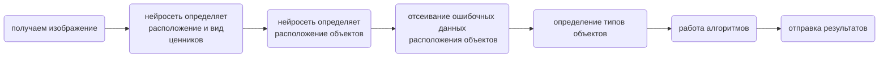

# Цифровая полка
### Наш продукт 
Цифровая полка должна стать помощником мерчендайзеров при анализе стеллажей магазина и\
структурировании полученной информации.

### Содержание <a name="desc"></a> 
* [Почему?](#why)
* [Основные функции](#func)
* [Схема распознования](#diagram)
* [Пример работы](#example)
* [Установка приложения](#download)

### Почему? <a name="why"></a> 
1. Работы человека без приложения занимает много времени
2. Скучный, рутинный подсчет может выполнить приложение
3. Пока наше приложение работает, человек получает результат

[назад к содержанию](#desc)

### Основные функции <a name="func"></a> 
- [X]	Определение количества ценников акционной и не акционной продукции
- [X]	Определение количества продуктов
- [X]	Определение количества полок на фотографии
- [X]	Определение длины выкладки продукции
- [X]	Определение вида продукта
- [X]	Определение ошибки выкладки продуктов
- [X]	Определение неполных полок 
- [ ]	Определение цен продукции
- [ ] Помощь в исправлении ошибок выкладки работникам магазина
- [ ]	Робот, занимающийся сбором информации о содержимом полок магазина автономно

[назад к содержанию](#desc)

### Схема распознования <a name="diagram"></a>



[назад к содержанию](#desc)

### Пример работы <a name="example"></a>

[назад к содержанию](#desc)

### Установка приложения <a name="download"></a>

```python
pip что-то там, Сеня, добавь кароч)))
```

[назад к содержанию](#desc)


