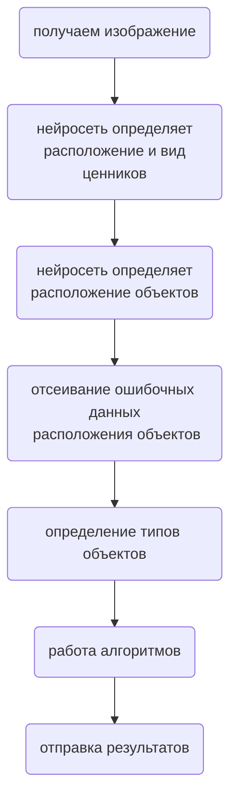
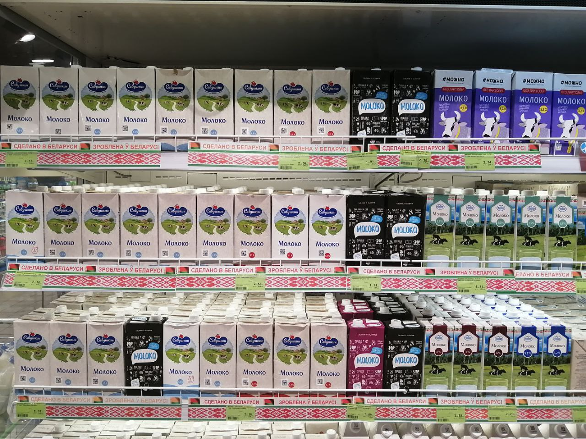
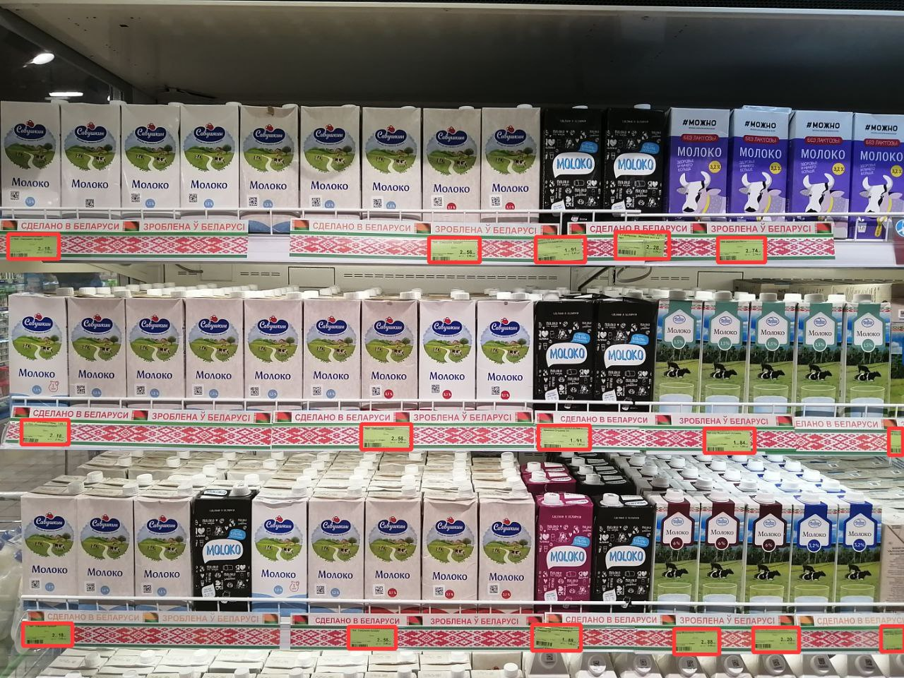
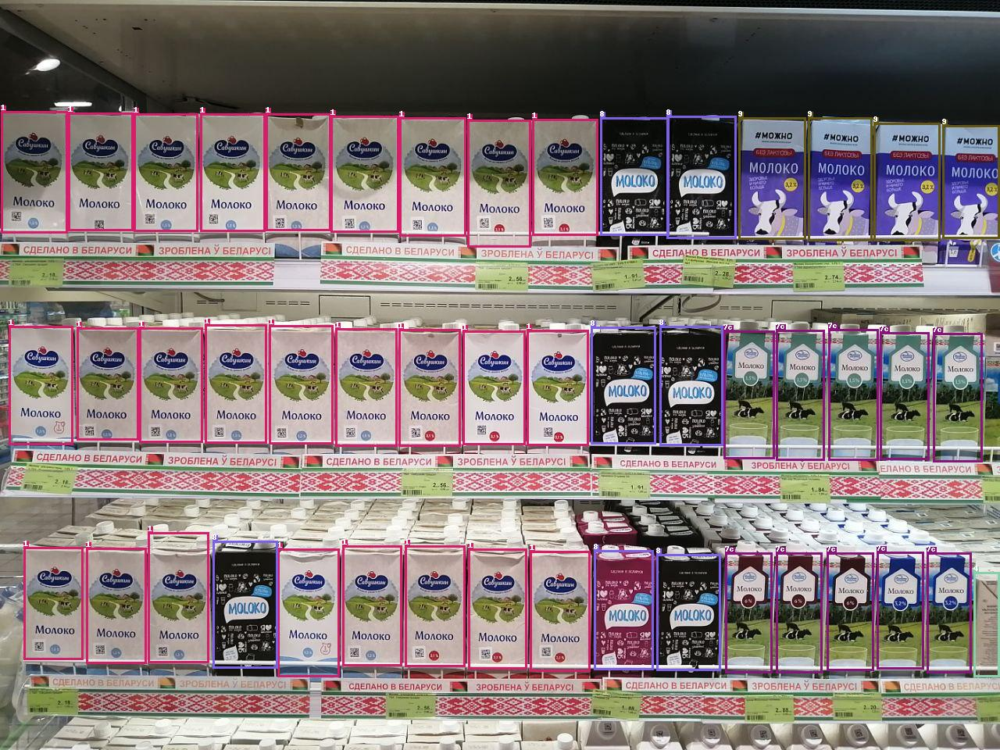

# Цифровая полка

### Наш продукт 
Цифровая полка должна стать помощником мерчендайзеров при анализе стеллажей магазина и\
структурировании полученной информации.

### Содержание <a name="desc"></a> 
* [Почему?](#why)
* [Основные функции](#func)
* [Схема распознования](#diagram)
* [Пример работы](#example)
* [Установка приложения](#download)

### Почему? <a name="why"></a> 
1. Работы человека без приложения занимает много времени
2. Скучный, рутинный подсчет может выполнить приложение
3. Пока наше приложение работает, человек получает результат


### Основные функции <a name="func"></a> 
- [X]	Определение количества ценников акционной и не акционной продукции
- [X]	Определение количества продуктов
- [X]	Определение количества полок на фотографии
- [X]	Определение длины выкладки продукции
- [X]	Определение вида продукта
- [X]	Определение неполных полок 
- [ ]	Определение ошибки выкладки продуктов
- [ ]	Определение цен продукции
- [ ] Помощь в исправлении ошибок выкладки работникам магазина
- [ ]	Робот, занимающийся сбором информации о содержимом полок магазина автономно


### Схема распознования <a name="diagram"></a>




### Пример работы <a name="example"></a>
Подаем на вход фотографию:



Бот присылает первую фотографию с выделенными ценниками



Бот присылает вторую фотографию (продукты одного класса выделены одним цветом):


Далее выводит результаты анализа фотографии:
```
  Количество полок: 3.
```
```
  Общее количество классов: 5.
```
```
  🏷Общее количество ценников:🏷
  ▸ Ценники без скидки: 16
```
```
  📏Длина поклассовой выкладки:📏
  1 полка
  ——————————
  ▸ молоко Савушкин 74 см;
  ▸ молоко красно-черное 17 см;
  ▸ молоко корова 33 см;

  2 полка
  ——————————
  ▸ молоко Савушкин 71 см;
  ▸ молоко красно-черное 16 см;
  ▸ малочны гастiнец 32 см;

  3 полка
  ——————————
  ▸ молоко Савушкин 23 см;
  ▸ молоко красно-черное 8 см;
  ▸ молоко Савушкин 38 см;
  ▸ молоко красно-черное 15 см;
  ▸ малочны гастiнец 29 см;
  ▸ сливки 33% 3 см;
```
```
  🛒Общее количество продуктов:🛒
  ▸ сливки 33%: 1
  ▸ малочны гастiнец: 10
  ▸ молоко красно-черное: 7
  ▸ молоко Савушкин: 26
  ▸ молоко корова: 4
```
Присылает последнюю фотографию с выделением ошибок выкладки или пустот на полках (в данном случае только ошибка выкладки):


#

### Установка приложения <a name="download"></a>
По умолчанию наш проект работает на архитектуре yolov5, поэтому следуя нижепреведенным инструкциям вы будете использровать именно ее.

```bash
git clone https://github.com/SenchaBrest/Digital_Shelf.git
```

```bash
pip install -r requirements.txt
```
Для скачивания весов пройдите по ссылке: [weights](https://github.com/SenchaBrest/Digital_Shelf/releases/tag/weights-yolov5).

#
Если вы хотите обучить самостоятельно, возьмите архивы фотографий [здесь](https://github.com/SenchaBrest/Digital_Shelf/releases/tag/Datasets).

#
Если вы хотите использовать программу на архитектуре yolov7, вам потребуется самостоятельно [склонировать](https://github.com/WongKinYiu/yolov7).
После этого вы можете скачать наш проект в файле zip и распаковать его в склонированном репозитории.
Для yolov7 веса находятся [здесь](https://github.com/SenchaBrest/Digital_Shelf/releases/tag/weights-yolov7).

#
[назад к содержанию](#desc)


